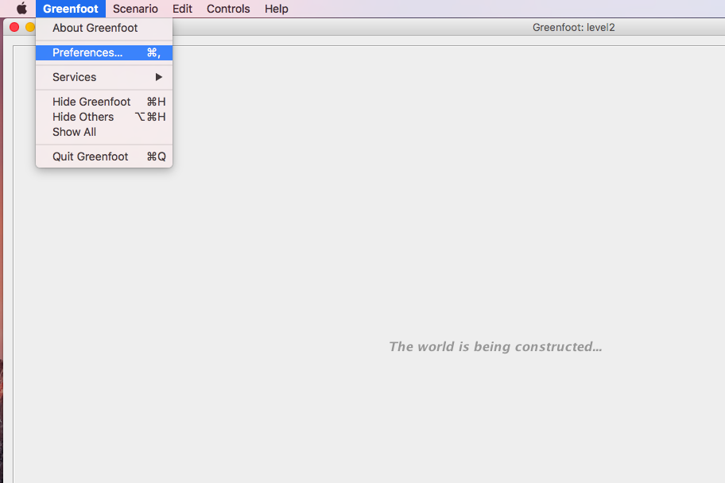
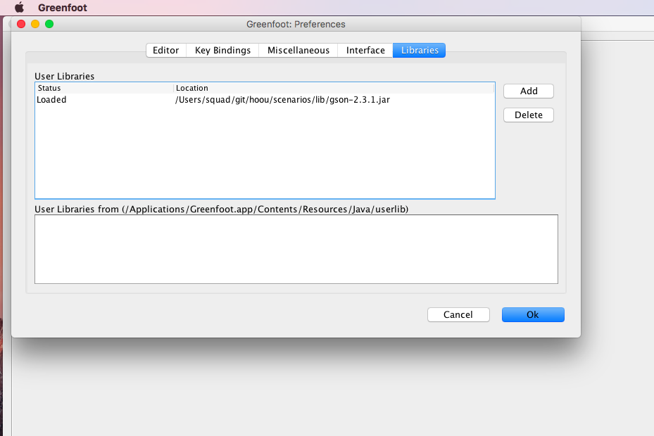
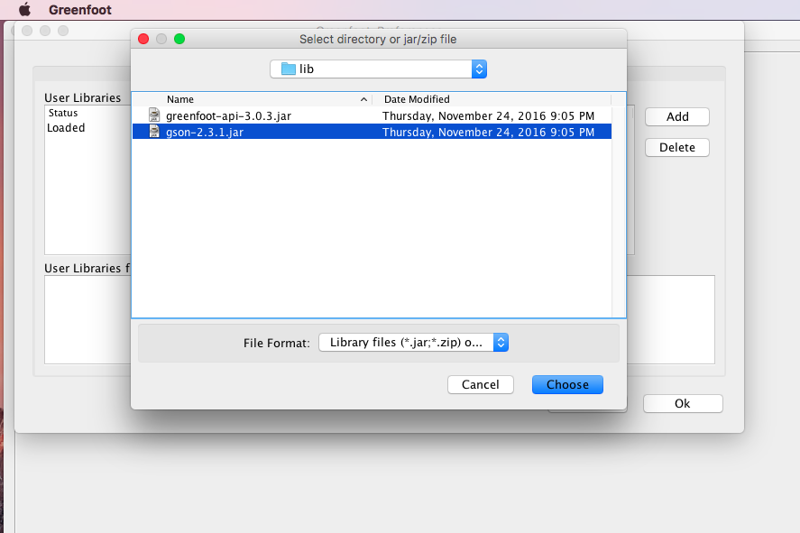

---
---
## Vorbereitung

### Installation von Java

### Herunterladen von Greenfoot

Greenfoot kann als Installation für die gängigsten Betriebssysteme heruntergeladen werden. Es wird empfohlen eine Version 3.0.4 oder höher zu verwenden. Die Downloadseite von Greenfoot kann über diesen Link erreicht werden: [Download Greenfoot](http://www.greenfoot.org/download). Ältere Versionen können über das Archiv geladen werden: [Ältere Versionen von Greenfoot](https://www.greenfoot.org/download_old)

### Herunterladen der Szenarien

Nun müssen noch die Szenarien heruntergeladen werden. Hier geht es zur neuesten Version: [Neueste Szenearien](https://github.com/program-and-play/scenarios/releases/latest). Lade das ZIP-Archiv mit den Szenarien herunter. Das heruntergeladene Archiv muss anschließend entpackt werden.

## Einrichtung unter macOS

### Installation von Greenfoot

Nach dem erfolgreichen Download muss die Installation durchgeführt werden. Für macOS reicht es aus, das von der Greenfoot-Seite heruntergeladenen ZIP-Archiv mit einem Doppelklick zu entpacken und in den Ordner zu wechseln der erstellt wurde. Ein Doppelklick auf die Greenfoot-Anwendung startet die Greenfoot-Umgebung.

### Einrichten der fehlenden JAR

Im nächsten Schritt muss die Datei lib/gson-2.3.1.jar in Greenfoot eingetragen werden. Dafür wird Greenfoot geöffnet und über das Menü Greenfoot > Preferences > Libraries ausgewählt.

 

Hier erhält man nun die Möglichkeit, User Libraries zu registrieren. An dieser Stelle muss die Datei gson-2.3.1.jar hinzugefügt werden. Nach einem Neustart von Greenfoot kann die Library verwendet werden.

## Einrichtung unter Windows

### Installation von Greenfoot

Nach dem erfolgreichen Download muss die Installation durchgeführt werden. Für macOS reicht es aus, das von der Greenfoot-Seite heruntergeladenen ZIP-Archiv mit einem Doppelklick zu entpacken und in den Ordner zu wechseln der erstellt wurde. Ein Doppelklick auf die Greenfoot-Anwendung startet die Greenfoot-Umgebung.

### Einrichten der fehlenden JAR

Im nächsten Schritt muss die Datei lib/gson-2.3.1.jar in Greenfoot eingetragen werden. Dafür wird Greenfoot geöffnet und über das Menü Greenfoot > Preferences > Libraries ausgewählt.

 

Hier erhält man nun die Möglichkeit, User Libraries zu registrieren. An dieser Stelle muss die Datei gson-2.3.1.jar hinzugefügt werden. Nach einem Neustart von Greenfoot kann die Library verwendet werden.

